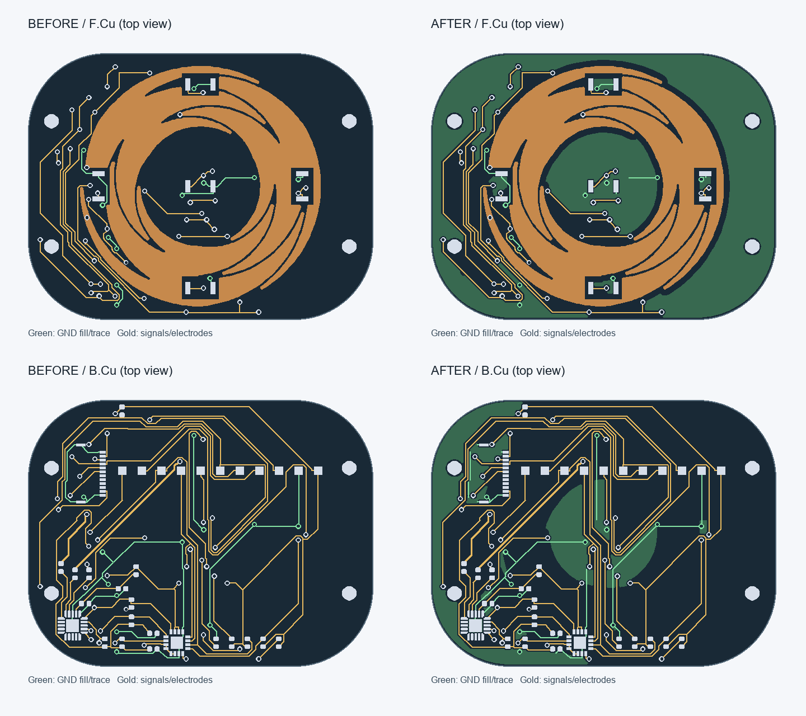

# 触摸小板 GND 铺铜优化

最终设计保存在 `../../controls.kicad_pcb`。本目录 `before/` 保存修改前的 PCB、原理图和项目设置；`candidate/` 是此次验证副本，不作为日常编辑工程。

## 改动和验证

|项目|修改前|修改后|
|---|---:|---:|
|GND 走线段数|99|75|
|GND 走线总长|153.42 mm|126.82 mm|
|GND 过孔数|12|12|
|全板走线段数|536|512|
|全板过孔数|57|57|
|GND 铜区|0|正反面各 1 个|

`before-drc.json`、`after-drc.json` 均为 KiCad 原生检查：0 违规、0 未连接、0 原理图一致性问题。逐组尝试移除地线并重铺铜，只保留通过检查的改动；必要的地线桥接和过孔没有删除。`comparison.json` 记录源文件 SHA-256，并验证所有封装定义（包括电极形状）、板框/绘图、元件位置、焊盘网络、非 GND 走线、原理图和项目规则未改变。

## 电容触摸避让

在 F.Cu 和 B.Cu 上设置明确的禁止铺铜规则区：E1 实际电极形状外扩约 0.8 mm，WHEEL0…2 / SENSE0…2 走线铜边外扩约 0.5 mm。两层避让形状相同，禁止新增地铜覆盖电极背面。规则区允许现有走线、焊盘和过孔通过，不会因重铺铜失效。中心按键、外围和芯片区域仅在避让区之外形成 GND 铜。

铜区间距 0.20 mm，最小铜宽 0.25 mm，热焊盘辐条宽和间隙均 0.20 mm，自动移除未连接铜岛。几何缓冲多边形简化容差为 0.015 mm；上述避让距离是本版设计余量，不是厂家承诺的触摸性能门限。

依据 [Microchip QTAN0079](https://www.microchip.com/content/dam/mchp/documents/OTH/ApplicationNotes/ApplicationNotes/doc10752.pdf) 的自电容布局建议，靠近电极的地铜会增加寄生电容、降低灵敏度，因此本板没有把电极背面整面铺实地。最终触摸阈值、手指滑动连续性及按键误触仍需结合实际覆盖层调试。

后续已从本次最终 PCB 重新导出生产资料：`../controls-jlcpcb-20260922-gerbers.zip`，制造文件位于 `../../fabrication-jlcpcb-20260922/`。旧 Gerber、STEP 和 FreeCAD 装配未覆盖。
