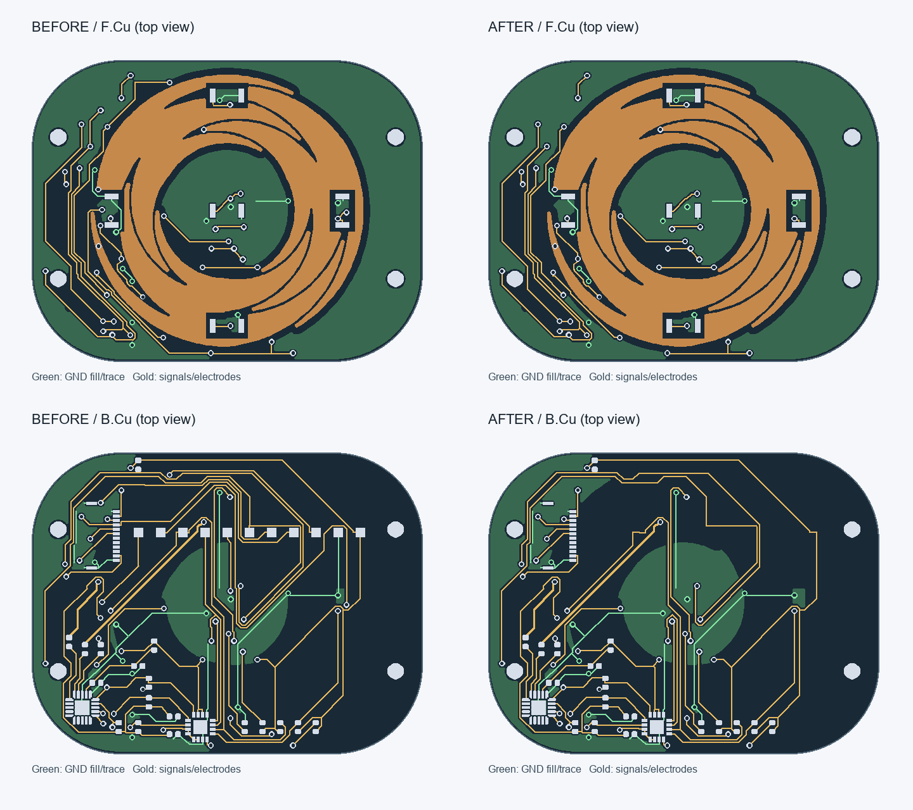

# 移除触摸小板测试点

TP1～TP11 已从原理图和 PCB 同步删除，其专用标签和连接线已移除。清理 70 段 PCB 分支走线及 5 个冗余过孔，走线由 512 段降至 442 段，过孔由 57 个降至 52 个。剩余 31 个封装对象，包括 26 个装配元件、触摸电极及四个安装孔。

`validation.json` 比较了删除前后的原理图网表：忽略 TP 节点后所有网络及引脚连接完全相同。其余封装定义、位置及板框均未改变。`erc.json` 和 `drc.json` 确认 0 ERC 违规、0 DRC 违规、0 未连接、0 原理图一致性问题。

修改前备份保存在 `before/`，`candidate/` 为验证副本；正式编辑请使用 `../../controls.kicad_pro`。

新生产包为 `../controls-jlcpcb-20260922-no-tp-gerbers.zip`。BOM 为 `../controls-jlcpcb-20260922-bom.csv`，仍为 10 类、单板 26 个元件；测试点不属于采购元件，删除不改变采购数量。调试可通过 J1 和元件焊盘测量。
