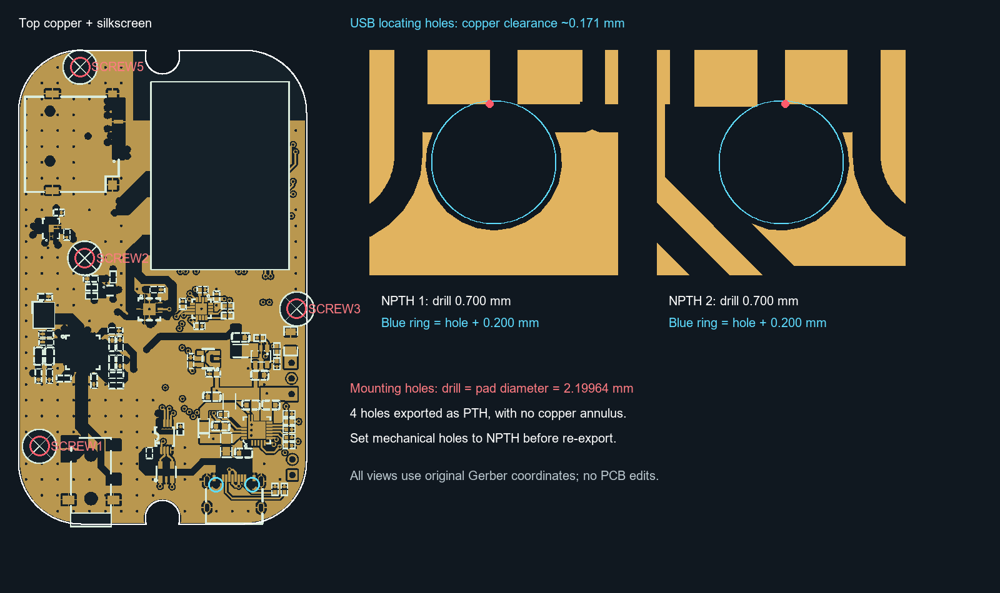
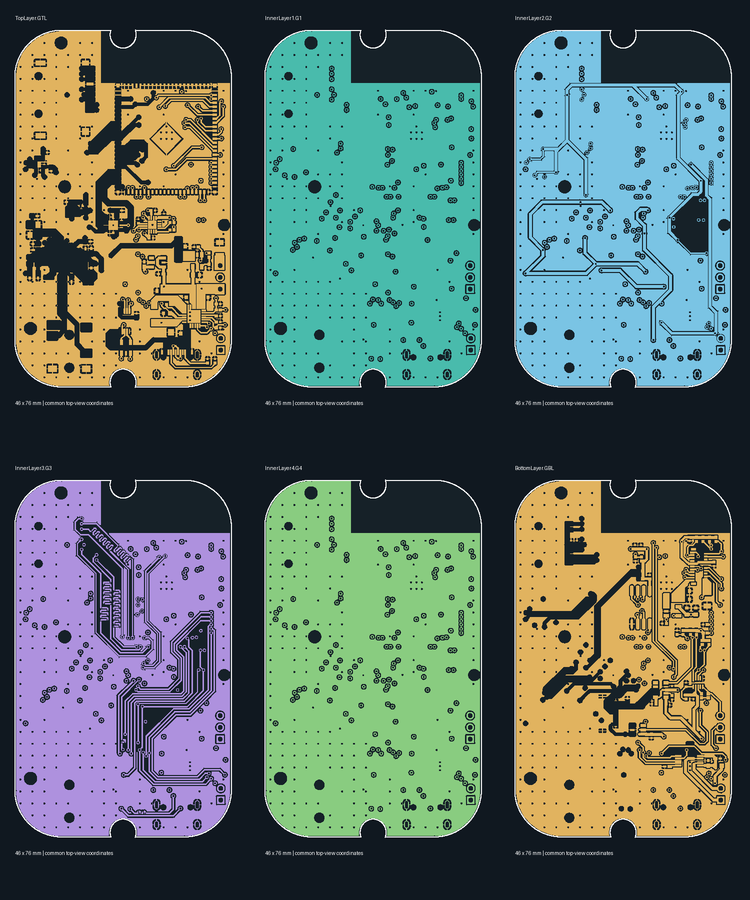

# esp32s31-mp3 Gerber 打板检查

检查日期：2026-09-22。对象：项目根目录 `esp32s31-mp3_gerber.zip`，不是旧的 `esp32s31-mp3-lceda-pro_gerber.zip`。

**结论：文件完整，基本具备六层板加工条件；建议先处理安装孔属性和 USB 定位孔铜间距，再重新导出打样。不建议把当前包当作已通过全部 DFM 的生产文件直接投产。** 两处问题均是局部制造定义/封装问题，本次未发现需要大面积重布线的证据。厂家 CAM 可能能代为处理，但应在生产稿中明确确认。

原 ZIP 和 PCB 工程均未修改，未上传或下单。

## 打板前处理

### 1. 四个安装孔被标为有铜孔，但没有焊环

`Drill_PTH_Through.DRL` 的 T05 包含四个直径 **2.19964 mm** 的孔；铜盘直径同样是 **2.19964 mm**，单边焊环为零。对应 SCREW1、SCREW2、SCREW3、SCREW5，飞针表分别带有孤立的 NET_43～NET_46。

| 位号 | KiCad X / Y，mm（定位参考） | 建议 |
|---|---|---|
| SCREW1 | 132.168 / 131.1465 | 机械孔改为 NPTH，无电气网络 |
| SCREW2 | 139.440 / 101.0080 | 同上 |
| SCREW3 | 173.367 / 109.1460 | 同上 |
| SCREW5 | 138.6755 / 70.3945 | 同上 |

如果这些孔仅用于外壳螺钉固定，明确改成 NPTH 并重导出；若确实需要金属化，应增加合适的焊环，而不能保留零焊环 PTH。官方说明中，无连接且盘孔等大的独立孔可能被按无铜孔处理；这正是需要消除的加工歧义，不能保证当前包一定被退单，也不能保证一定按有铜孔制作。[嘉立创孔属性说明](https://www.jlc.com/portal/server_guide_4061.html)

另：当前 KiCad 封装名为“M3螺丝”，实际孔径却只有约 2.20 mm。名称不能作为螺钉规格依据；若实物是 M3 螺钉，这个孔不适配。不要直接扩大孔，SCREW3 已较靠近板边，应结合实际螺钉和结构确认。

### 2. USB1 两个无铜定位孔距铜不足 0.2 mm

两个孔直径 **0.70002 mm**，顶层到相邻 USB 地焊盘的最小距离分别约 **0.17129 / 0.17128 mm**。

| 项目 | Gerber 坐标 X / Y，mm | KiCad 对应坐标约，mm | 邻近焊盘 |
|---|---|---|---|
| USB 左定位孔 | 600.42615 / -217.28747 | 160.42615 / 137.28747 | USB1_A1B12 |
| USB 右定位孔 | 606.20618 / -217.28747 | 166.20618 / 137.28747 | USB1_B1A12 |

嘉立创无铜孔干膜封孔会掏空孔周围 **0.2 mm** 的铜。当前焊盘角部进入该区域约 0.029 mm；这是小范围侵入，并非已发现短路或必然断线。建议按连接器实物图检查封装，并将这两处铜退让至至少 0.20 mm，能留 0.25 mm 更稳妥；不要为此随意移动定位孔。若由 CAM 修铜，应核对修后的地焊盘形状。[当前工艺表](https://www.jlc.com/portal/vtechnology.html)、[无铜孔设计指引](https://www.jlc.com/portal/server_guide_4061.html)

## 已检查的数据

| 项目 | 实测结果 | 说明 |
|---|---|---|
| 铜层 | GTL、G1、G2、G3、G4、GBL，共六层 | 每层均有实际铜图形 |
| 板框 | 46.000 × 76.000 mm，闭合且无自交 | 圆角及上下缺口完整；尺寸按中心线，不含板框画笔宽度 |
| 阻焊、丝印 | 顶底层齐全 | 顶层少量丝印/外形图超板框，可被裁切 |
| 电镀钻孔 | 342 个加工对象 | 329 个过孔、5 个圆形插件孔、4 个有铜槽、4 个安装孔 |
| 无铜钻孔 | 6 个圆孔 | 0.70002、1.20、1.60 mm，各两个 |
| 过孔孔径 / 铜盘 | 0.305 / 0.610 mm | 名义单边焊环 0.1525 mm |
| 明确以圆光圈绘制的最小线宽 | 0.2032 mm（8 mil） | 不等于对所有区域多边形的细颈都做了最小宽度检验 |
| 不同电气连通区域的最小铜间距 | 约 0.13614 mm | 满足外层 1 oz 常规能力；不宜直接改选 2 oz |
| 铜至板边最小间距 | 约 0.25163 mm | 满足当前锣边 ≥0.2 mm；无需因旧文档的 0.3 mm 值认定不合格 |
| 孔边至板边 | 最小约 0.40136 mm | 未见孔跨出板框 |
| 孔边至孔边 | 未检出小于 0.30 mm | 使用去重后的全部圆孔和槽孔 |
| 铜越界 | 六层均为 0 | 天线区域在六层上均可见避铜；未按模组射频指南单独验收 |
| 网表连通性 | 168 个电气网络未检出明显短路/断路 | 四个孤立机械孔网络另外列出，不误报为电路断路 |

现行嘉立创工艺表：多层板 1 oz 最小线宽/线隙 0.09/0.09 mm；2 oz 最小 0.15/0.15 mm。锣边铜间距 ≥0.2 mm。[官方工艺能力](https://www.jlc.com/portal/vtechnology.html)

## 导出包说明与下单参数

- `Drill_PTH_Through_Via.DRL` 中的 **329 个孔全部重复出现在主 PTH 钻孔文件中**，没有额外孔。本次几何检查只计一次。它是单独的过孔数据子集，不能仅凭重复就认定 Gerber 错误，也不应盲目删除厂家可能用于识别过孔/塞孔的资料；交给 CAM 时按原 EDA 文件角色识别，不要当成第二组额外钻孔作业叠加。
- 板框用 **GKO**。GDD 是钻孔说明图，GDL 是文档图；不能当作额外铜层或另一套板框。GTP/GBP 是钢网层。
- 六层顺序：**GTL → G1 → G2 → G3 → G4 → GBL**。G1 与 G4 的铜几何相同，均为地平面为主，不能因此合并或少下两层。
- 建议按 **FR-4、6 层、46 × 76 mm、锣边、外层 1 oz、沉金** 准备打样。项目 KiCad 板厚为 **1.6 mm**，但 Gerber 本身不包含层间介质厚度，板厚及具体叠构仍需在订单里明确。
- 有焊盘内过孔（例如 U2、U8、U12 的接地散热焊盘）；顶面有 13 个过孔中心位于阻焊开窗内。使用 **树脂塞孔＋电镀盖帽**，不要把普通盖油当成填平焊盘。嘉立创当前六层及以上默认该工艺，支持本板 0.305 mm 孔径。[官方工艺能力](https://www.jlc.com/portal/vtechnology.html)
- USB 差分线的目标阻抗、层间介质、阻抗计算及公差未包含在此包中。本次没有验证 USB 信号完整性、供电载流或音频噪声。
- 顶层丝印约 4.23 mm² 在板框外，另有极少量丝印碰到开窗铜（约 0.0113 mm²）；可整理后再导出，通常影响标记完整性而非电气连通。

## 方法与结论边界

使用 Gerbonara 1.6.3 解析实际 ZIP 的 RS-274X / Excellon，Shapely 2.1.2 对正负图形合成、板框、钻孔和铜区域进行几何检查。圆弧离散误差目标 0.0002 mm，圆/圆头按每象限 64 段离散；零间隙多边形用 0.000001 mm 容差重联，过孔接触判定采用 0.001 mm 邻域。以钻孔建立跨层连接，再与同包 FlyingProbeTesting.json 比对。1153 行焊盘记录包含重复项及 PADxxx 副本，不能理解为 1153 个独立元件。

此结论是本地 CAM 几何与同包网表的一致性检查，**不是源原理图 ERC、独立 IPC-D-356 电测验收，也不是嘉立创官方 DFM 放行**。无法证明源电路设计、芯片引脚定义、封装尺寸、阻抗或成品功能正确；微小铜颈、全部阻焊桥和盘中孔工艺细则仍需厂家 DFM。

另外只读核对了当前 `ProPrj_esp32s31-mp4_2026-09-22.kicad_pcb` 的 135 个元件：位置及面别与飞针文件在 0.001 mm 容差内一致（Gerber X = KiCad X + 440；Gerber Y = -KiCad Y - 80）。这仅用于问题定位，未把 KiCad DRC 当作该 Gerber 的检查结果。

机器可读数据：`analysis.json`、`details.json`；解压副本：`source/`。复现脚本在项目 `tmp/analyze_gerber.py` 与 `tmp/gerber_review_details.py`。

原 ZIP SHA-256：`b19e62ce2dea8b325a22fa7018b0050f2267d186243c677b0189bec4cc1c4993`。
