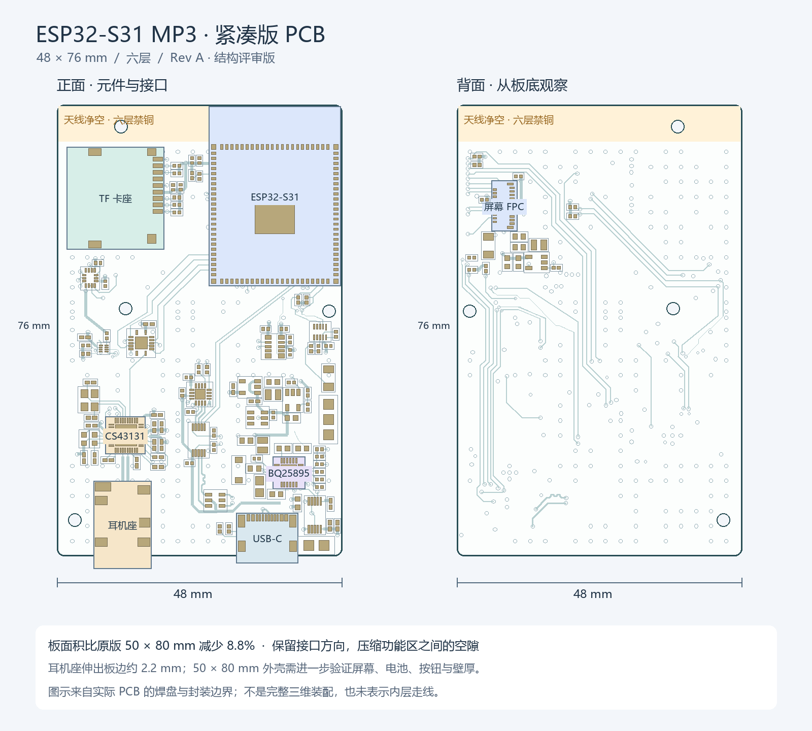

# ESP32-S31 MP3 · 紧凑版硬件 Rev A

本目录为基于原始嘉立创工程迁移、修正并缩小的 KiCad 10 工程。PCB 为 **48 × 76 mm、六层、R1.2 mm 圆角**，比原版 50 × 80 mm 面积减少 **8.8%**。这是可继续编辑和结构评审的版本，尚未完成整机装配及实物电气验证。

## 打开与预览

使用 **KiCad 10.0.4 或兼容版本**打开 `hardware.kicad_pro`，从项目管理器进入原理图和 PCB。符号、封装均使用本目录相对路径，不依赖嘉立创在线库。

- `hardware.kicad_sch`：总览及九张子页。
- `hardware.kicad_pcb`：126 个封装，已布线、铺铜。
- `MP3_Source.kicad_sym`、`MP3_Source.pretty/`：工程内符号和 42 个封装文件。
- `output/layout-overview.png`：正反面布局和尺寸预览。
- `output/assembly-top.svg`、`assembly-bottom.svg`：实际封装装配图。
- `output/schematic/`：十张原理图 SVG。
- `output/board-only.step`：KiCad 导出的板体 STEP；FreeCAD 实体复核为 48 × 76 × 0.91 mm，导出板体未包含外表铜及阻焊的厚度。结构预留应按暂定名义板厚 1.0 mm 加公差计算；不含元件、屏幕、电池或外壳。
- `output/pcb-top.png`：KiCad 裸板渲染。原始工程没有可用的完整元件三维模型，不能用它判断器件高度。
- `output/drc.json`、`erc.json`、`netlist.xml`、`validation-summary.json`：检查报告及网络表。



## 本次修改

1. 从 `.epro2` 原工程导出兼容的 EasyEDA Pro V2 工程，再用 KiCad 原生导入，保留原器件封装和六层连接。原始 Gerber 作为原版层数和外形依据；新板没有直接复用 Gerber 图形充当可编辑布线。
2. 保留顶部 TF 卡座、右上主控、左下音频、右下充电供电、底部 USB-C / 耳机座、背面屏幕 FPC 的功能布局；压缩功能区间隙并收紧外框，重布受影响网络和局部地连接。
3. 修复跨页网络标签、短接符号和导入形成的微小断线；统一网络别名，记录在 `reference/net-aliases.json`。原理图网格整理和悬空线段清理前后，168 组“器件引脚集合”的连接分组保持一致。
4. 按 CS43131 数据手册修正 U2 的 I²C 引脚：**1 脚 SCL、39 脚 SDA**，并同步修正 PCB。补全 C32 / C33 晶振电容的原理图接地。修正可选下载电路的 BOOT 网络名。
5. 校正主要芯片引脚电气类型和电源驱动标识；保留原工程排除出 PCB 的可选电路，不将缺件强行补装。排除项包括 Q1、Q2、R23、R24、C13、R15、R16、U10、R6、C52、C60；具体以原理图的 `on_board` / DNP 属性为准。
6. 将原来落在 Edge.Cuts 上、不能约束铜层的天线禁布区修正为六层铜禁布，重新铺铜。板顶约 6.169 mm 范围禁止走线、过孔、铺铜；为保留 SCREW5 非金属化孔，区域允许焊盘对象，另外核对现有铜焊盘均未侵入此区域。以后移动或增加器件时必须重新核对。
7. 移除原版板框外的 SCREW3，将其余四个安装孔改为 Ø2.2 mm NPTH，供 M2 安装使用。源封装中的零环宽镀铜孔不再沿用。
8. 将不适合印刷的源封装轮廓转到 Fab 层，整理原理图页框、说明和目录，清除无效导入图形。装配时应参考 Fab 图；生产丝印仍应按最终装配需求补充。

## 尺寸和结构约束

[山灵 Q2 官方代理商发布资料](https://prtimes.jp/main/html/rd/p/000000232.000139013.html)给出的整机尺寸是 **80 × 50 × 13.5 mm**，屏幕突出部最大厚度 14.2 mm。本版以不超过其长宽为目标，但 **PCB 长宽合适不等于整机已经装得下**。

| 项目 | 当前值 / 状态 |
| --- | --- |
| 板框 | 宽 48.00 × 高 76.00 mm；圆角 R1.20 |
| 板厚 | 暂定 1.00 mm，需板厂确认六层叠层 |
| 耳机座 | 源封装边界伸出底边约 2.19 mm |
| USB-C | 源封装边界伸出底边约 1.22 mm |
| 板框加底部接口的纵向占用 | 约 78.19 mm，未计实物尺寸误差和外壳壁厚 |
| 屏幕 | 原工程标注 2.09 英寸、320 × 375、QSPI；缺完整屏体 / FPC 折弯结构模型 |
| 安装方式 | 4 个 M2 通孔；靠右的螺钉头及柱外径需要单独校核 |
| 外壳 | 当前外观方向为 [Q2 修订 C](../mechanical/enclosure-q2-c/README.md)，50 × 80 × 13.5 mm、含盖板 14.2 mm；现有 PCB 与大圆角壳体有干涉，须改板。旧 A 版仅保留追溯 |

以下孔中心以 PCB 左上角为原点，X 向右、Y 向下，单位 mm。KiCad 绝对原点为 `(100, 50)`。

| 孔位 | X | Y | 孔径 |
| --- | ---: | ---: | ---: |
| SCREW1 | 3.0615 | 69.9635 | 2.20 NPTH |
| SCREW2 | 11.5730 | 34.3608 | 2.20 NPTH |
| SCREW4 | 45.8365 | 34.7870 | 2.20 NPTH |
| SCREW5 | 10.8085 | 3.7485 | 2.20 NPTH |

上述接口伸出量由源封装图形估算，不代替连接器尺寸图。天线周围还必须避开金属外壳、屏幕金属背板和电池铝箔；建议顶部使用非金属射频窗口，并按[乐鑫硬件设计指南](https://documentation.espressif.com/esp-hardware-design-guidelines/en/latest/esp32s31/index.html)完成整机射频复核。

## 检查结果与范围

2026-09-21，使用 KiCad 10.0.4：

| 检查 | 结果 |
| --- | --- |
| PCB DRC，重新铺铜后 | 0 错误、0 警告 |
| 未连接项目 | 0 |
| 原理图 / PCB 一致性 | 0 差异 |
| ERC | 0 错误、9 警告 |
| 原理图网格及悬空线整理 | 168 组引脚连接分组一致 |
| 当前铜焊盘侵入天线区 | 0 |
| 裸板 STEP / FreeCAD 1.1.1 | 单一有效实体，48 × 76 × 0.91 mm 板体 |

ERC 的 9 条警告均为单引脚网络标签：`ESP_IO5`、`STC3115_ALM`、`BQ25895_USB_DP`、`BQ25895_USB_DN`、`BQ25895_STAT`、`BQ25895_QON#`、`BQ25895_DSEL`、`GEK100_KEY`、`GEK100_RST`。它们没有被隐藏或改成已接通；其中 KEY 的外接按钮必须处理，其他信号应按最终产品功能决定接出或不用。

报告中的 `ignored_checks` 明确列出了工程未启用的检查类别，例如缺少 courtyard、封装类型/过滤器检查、单次全局标签等；“0 DRC”仅指当前规则下的检查通过，不代表所有制造能力和电气性能均已验证。

## 打样前必须完成

- **开机按钮**：GEK100 的 KEY 必须通过外部常开按钮接 GND。本版本尚未新增按钮座或按钮器件，不能据此认定离线开机功能完整。KEY 内置上拉、RST 内置下拉；按[厂家数据手册](https://gsctek.com/uploads/allimg/20251225/1-251225110HM63.pdf)确认订货后缀。原图注释为 GEK100-57，采购和开关时序必须对应。
- **下载方式**：原版自动下载三极管为未装/不进 PCB 的可选部分；需要在样机确认原生 USB 下载、BOOT / EN 操作和恢复方式，不能假设 CH343 已实现自动下载。
- **板厂叠层与 USB**：六层板厚暂定 1.0 mm；最小线宽/间距 0.127 mm，新增过孔 0.50/0.25 mm。USB 差分的 90 Ω 目标仍需结合实际介质、铜厚、参考层计算和复核，尚未做阻抗或信号完整性仿真。
- **USB-C 内部槽**：`hardware.kicad_dru` 仅对 USB1 封装内部定位槽采用 0.15 mm 铜到槽边要求，源几何约 0.173 mm；外板边仍要求 0.30 mm。必须让板厂接受该局部工艺，或更换连接器封装重新布线。
- **器件/结构实物确认**：屏幕外形现已按用户图纸建模为 36.33 × 43.45 × 1.46 mm、显示区 34.18 × 40.05 mm；其连接器、引脚排列和折弯半径仍需核对。Q2 修订 C 已把 ESP32 面朝屏幕、FPC2 朝后盖，并新增独立滑环/按键小板的机械模型；仍检出旧板及 U9/H1/C5/C58/CN1 包络与壳体相交，屏幕上移也影响天线净空；旧 A 版的无干涉结果不能用于新外观。电池、插座实物高度和操作环电路仍待落实。
- **上电验证**：按限流供电逐项验证充电和电源轨、启动、屏幕/TF、DAC 的 I²C 和音频输出、噪声、射频及热表现。ERC 的电气类型校正和 PWR_FLAG 标识不代替实测。

## 来源和备份

根目录的三份用户源文件保持原样：`esp32s31-mp3-lceda-pro.epro2`、`esp32s31-mp3-SCH_Schematic.pdf`、`esp32s31-mp3-lceda-pro_gerber.zip`。

`reference/initial-kicad/` 保存修改前的 KiCad 工程；`reference/original-v2.epro` 保存兼容导出；`reference/native-original.zip` 保存原生导入后的基线，供追溯使用，不是最终工程。原版 Gerber 不能用于生产新尺寸 PCB。

主要参考数据手册已保存为 `reference/esp32-s31-wroom-3.pdf`、`cs43131.pdf`、`bq25895.pdf`。

重新检查可在本目录执行：

```powershell
kicad-cli sch erc --format json -o output/erc.json hardware.kicad_sch
kicad-cli sch export netlist --format kicadxml -o output/netlist.xml hardware.kicad_sch
kicad-cli pcb drc --refill-zones --save-board --schematic-parity --format json -o output/drc.json hardware.kicad_pcb
```

检查报告对应当前保存版本；后续修改后需重新生成。当前未发布新板生产 Gerber。

## 工具连接状态

KiCad MCP 在本次会话的连接测试中可用，但服务器配置为只读；实际工程编辑使用本机 KiCad API / CLI。FreeCAD MCP 前期测试可用，最终 STEP 复核时其 RPC 返回连接被拒绝，且 MCP 的独立进程入口未配置 `freecadcmd`。已改用本机 `D:/FreeCAD/1.1/bin/freecadcmd.exe` 完成 STEP 几何复核，报告见 `output/step-validation.json`。这不影响保存好的 KiCad 工程；若继续通过 FreeCAD MCP 交互，需要恢复 FreeCAD 的 RPC 服务。

后续外壳设计任务中，FreeCAD MCP 的 RPC 已恢复正常。最新内部装配修订 C 位于 `mechanical/enclosure-q2-c/`（操作小板仅机械外形，电路待实现）；B 版外观与独立 LCD 工程位于 `mechanical/enclosure-q2/`；旧 A 版位于 `mechanical/enclosure/`。本次外观修订未改写 KiCad 板文件，不应将原板 DRC 通过视作已经适配新壳。
