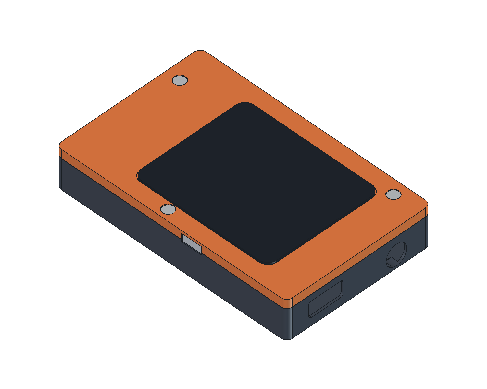

# ESP32-S31 MP3 外壳 A · FreeCAD 装配样壳

已根据当前 **48 × 76 mm PCB** 建立前盖、后壳和侧面电源键，包含真实板框/孔位及器件占位装配。采用圆角、橙色前框、深灰后壳的 Q2 风格方向；外观配色只是模型显示色，未复制品牌标识。

**名义机身 50 × 80 × 13.5 mm，含镜片最高 13.85 mm。** 长宽与 Q2 相同，镜片最高点低于 Q2 公布的 14.2 mm 最大厚度。[Q2 尺寸来源](https://prtimes.jp/main/html/rd/p/000000232.000139013.html)

当前按非金属树脂打印试配设计。屏幕、电池、连接器高度和轻触开关尚未拿到完整实物尺寸，因此这是**有条件通过占位模型检查的样壳，不是已验证的量产外壳**。

## 文件

| 文件 | 用途 |
| --- | --- |
| `ESP32S31_MP3_Enclosure_A.FCStd` | 主工程，FreeCAD 1.1.1 创建；原生实体运算和尺寸表，可编辑 |
| `parameters.json` | 重建脚本的尺寸输入，单位 mm |
| `build_enclosure.py` / `Rebuild.FCMacro` | 重建实体、干涉检查、STEP/STL 导出 |
| `Verify.FCMacro` / `verify_exports.py` | 重读导出文件，并临时改动/恢复壁厚，验证尺寸表重算 |
| `prepare_views.py` | 在 FreeCAD GUI 中生成预览、爆炸图快照并保存显示状态 |
| `exports/rear-shell.stl` / `.step` | 后壳 |
| `exports/front-shell.stl` / `.step` | 前盖 |
| `exports/power-button.stl` / `.step` | 电源键帽及限位结构 |
| `exports/assembly-reference.step` | 带板子和占位器件的装配参考；不要整体打印 |
| `exports/validation.json` | 建模尺寸、源 PCB 哈希、实体/干涉/外包络检查 |
| `exports/export-validation.json` | 重新读取 STEP、STL 和参数重算的检查 |
| `exports/assembled.png` / `exploded.png` | 外观与爆炸图 |
| `exports/rear-interior.png` | 后壳内部及电池占位 |



## 已实现的结构

- 前后分壳，分型面 Z=10.4 mm，合壳间隙 0.10 mm；内止口深 0.9 mm、横向间隙 0.20 mm。
- 后壳侧壁 0.75 mm、底板 1.0 mm；PCB 每侧名义间隙 0.25 mm。前盖在 PCB 上方采用更厚的 1.5 mm 侧壁。
- 四个 PCB 安装柱对应原板孔位。SCREW4 顶部缩颈避开 U14 的封装占位，SCREW2 螺钉在屏幕后方，先安装 PCB 再合前盖。
- 三个前盖螺钉兼作 PCB 压紧；预设 3 颗 M2×10、1 颗内部 M2×6。螺钉头应不大于 Ø3.8 × 1.6 mm，模型采用简化头部。树脂柱的 Ø1.65 mm 底孔需按材料/打印公差修孔攻牙，不能直接强拧。
- USB-C 采用 12.0 × 5.5 mm 圆角通口，给插头胶壳留进入空间；耳机口 Ø7.2 mm。两个接口均在板底方向。
- TF 侧向开口 15.6 × 2.4 mm，按当前卡座朝向设置；需要用实物卡验证按压、弹出及手指可达性。
- 侧面电源键有内限位凸缘和推杆，前盖内有轻触开关支撑面。键帽释放至外止点时与机身齐平，名义状态略内凹。开关是待选的外接件，仍需连接主板 `GEK100_KEY` 与 GND。
- 前盖有屏幕窗口、屏体避让和镜片粘接台阶；后壳底部预留电池粘接位置。

## 当前装配假设

| 项目 | 采用的尺寸 / 限制 |
| --- | --- |
| PCB | 48 × 76 mm，名义 1.0 mm；导入板体 0.91 mm，补偿外表铜/阻焊位置 |
| PCB 高度 | 元件面朝后壳，后铜面 Z=7.1 mm，屏幕侧铜面 Z=8.1 mm |
| 屏体占位 | 36.5 × 44.0 × 2.1 mm，Z=10.8～12.9 mm |
| 屏幕通窗 | 35.0 × 41.0 mm，需按实际显示有效区复核 |
| 镜片占位 | 38.8 × 46.8 × 0.6 mm，最高 Z=13.85 mm；粘接台阶需实测 |
| 电池占位 | **26 × 34 × 3 mm**，底部留 0.3 mm 粘接层；没有指定容量或可采购型号 |
| H1 / H2 | 模型按高度 5.5 mm；为留至少 0.3 mm 底部间隙，实物应 ≤5.8 mm，否则改用矮座/焊线或增加机身厚度 |
| 其他元件高度 | 根据类别暂定；不是供应商提供的完整 3D 模型 |
| 天线净空 | 屏体顶部离板顶禁铜区末端约 15.33 mm；上部外壳用非金属，SCREW5 优先使用非金属紧固件 |

电池尺寸应包含实际封装/保护板所需区域，出线、FPC 折弯、连接器插入行程和装配工具空间仍需实物复核。模型没有推算电池容量或续航。

后壳薄壁是当前板宽与 50 mm 外宽共同决定的：`0.75 + 0.25 + 48 + 0.25 + 0.75 = 50 mm`。打印服务商需确认该壁厚、止口及小安装柱是否适合其材料和工艺；本版不能直接当作 FDM 厚壁件或 CNC 金属件加工。若改用金属外壳，必须重新设计天线窗口和绝缘。

## 校验范围

FreeCAD/OCCT 检查前盖、后壳、键帽均为单一有效实体；导出 STL 为闭合网格。当前尺寸下，报告所列壳体、PCB、屏体、电池、元件占位和按键的检查对中，均未发现正体积干涉，也没有超出名义整机包络。

螺纹连接的材料啮合是预期关系，不按普通零件碰撞判断。没有进行强度/跌落、热、射频、电池鼓胀或打印收缩仿真；占位模型无干涉不等于实际组件无干涉。最终型号确定后应替换占位体重新检查。

## 装配顺序

1. 先打印前后壳和键帽进行空壳配合；修整止口、螺钉孔和接口开口，检查薄壁完整性。
2. 在后壳安装绝缘层/电池固定胶，放入电池并安排出线；禁止让螺钉、毛刺或元件尖端压住电芯。
3. 放入 PCB，对齐四孔；用 SCREW2 的内部 M2×6 螺钉先固定 PCB。
4. 在前盖安装键帽、选定的轻触开关和其绝缘固定材料；接出按键线。模型只有开关支撑面，不包含已验证的商品开关卡扣。
5. 安装屏幕、FPC 和镜片粘接材料，确认排线不经过螺柱、不覆盖天线；前盖三个柱脚对准剩余孔位。
6. 用 3 颗 M2×10 合壳。先手动确认螺钉不顶底、不压屏，再逐步拧紧；逐项测试卡/线缆插拔及按键回弹。

## 编辑和重建

主工程内的 `Parameters` 尺寸表控制原生 `Part::Box`、`Part::Cylinder`、布尔组合及开孔。改表后重算即可观察壳体变化。PCB 外形仍来自 KiCad；改变壳体参数不会自动改变电路板。

要重新导出并运行完整检查，应修改 `parameters.json`，保存并关闭已打开的外壳文档，再运行 `Rebuild.FCMacro`。**JSON 是重建时的输入；在尺寸表中试调的值需自行同步回 JSON。** 固定参考体、螺钉示意和爆炸图快照在重建时更新，不能用旧快照验证修改后的参数。

也可从项目根目录运行：

```powershell
& 'D:\FreeCAD\1.1\bin\freecadcmd.exe' mechanical/enclosure/build_enclosure.py
```

输出出现 `ENCLOSURE_BUILD_COMPLETE` 且 `validation.json` 中 `geometric_checks_passed` 为 `true` 才表示本轮模型检查完成；FreeCAD 命令行有时在脚本异常后仍返回退出码 0，因此不要只看进程退出码。

本设计读取 `hardware/output/board-only.step` 和 `layout-data.json`，未修改 KiCad PCB。后续改板后必须重新导出这两项并重建外壳。
